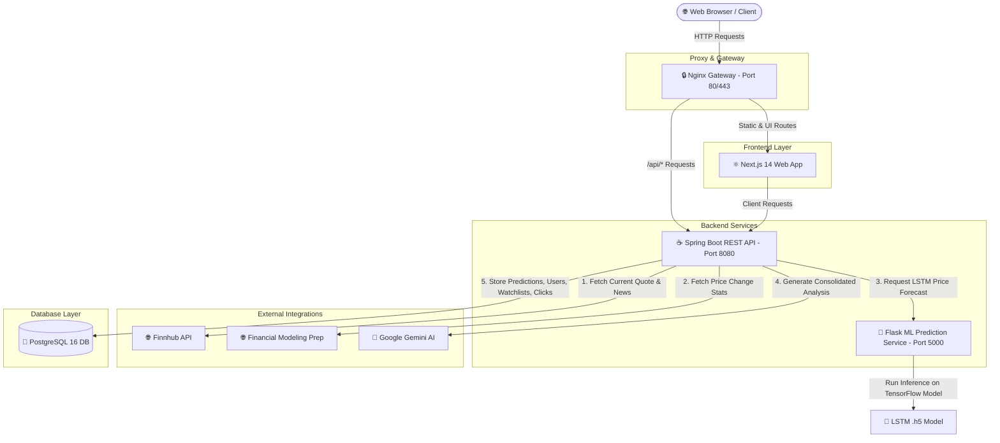

# 📈 AI-Powered Stock Analyzer & Predictor

[](https://nextjs.org/)
[](https://spring.io/projects/spring-boot)
[](https://www.tensorflow.org/)
[](https://deepmind.google/technologies/gemini/)
[](https://www.docker.com/)
[](https://www.postgresql.org/)

StockPulse is a state-of-the-art, full-stack stock analysis and price forecasting application built as a Graduation Thesis (*Lucrare de Licență*). It integrates real-time financial market APIs, an offline LSTM deep learning model for price forecasting, a conversational Google Gemini AI analyst, and an innovative broker priority bidding advertising engine.

---

## 🗺️ Table of Contents

- [💡 Key Features](#-key-features)
- [🏗️ System Architecture](#️-system-architecture)
- [🛠️ Technology Stack](#️-technology-stack)
- [📊 Database Schema & Bidding Monetization](#-database-schema--bidding-monetization)
- [🚀 Quick Start (Docker Compose)](#-quick-start-docker-compose)
- [⚙️ Local Development Setup](#️-local-development-setup)
- [🔌 API Endpoints Reference](#-api-endpoints-reference)

---

## 💡 Key Features

### 📈 Technical & AI Analysis Dashboard
- **Real-Time Data Integration**: Fetches quotes, financial news, and insider sentiment from Finnhub, and short/medium-term historical price fluctuations from Financial Modeling Prep (FMP).
- **Interactive Price Chart**: Overlays 20, 50, 100, and 200-day Exponential Moving Averages (EMA) with predictions.
- **AI Summary & Recommendation Generator**: Leverages Google Gemini via Spring AI to process complex metrics and output structured recommendations (`BUY`, `HOLD`, `SELL`) valid for 24 hours.

### 🧠 Deep Learning Price Forecasting
- **LSTM Deep Learning Model**: A custom-trained Long Short-Term Memory network utilizing 60-day historical window sequences to forecast the next closing price.
- **Microservice Design**: Decoupled Python Flask API loading the TensorFlow model `.h5` file and running background inference.

### 💬 Interactive Stock Chatbot
- **Contextual Financial AI**: Chat directly with Gemini about any stock ticker. The chatbot references the stock's current price, recent news, and technical trends to answer questions.

### 💰 Broker Priority Bidding Engine
- **Priority Placement Ads**: Registered brokers bid a custom amount-per-click to gain priority visual real estate in the stock detail views.
- **Pay-Per-Click Billing**: User redirects are tracked in `broker_clicks` and charged against the broker's active `daily_budget`.
- **Budget Tracking**: Automates auto-deactivation of brokers when they reach their daily budget ceiling.

---

## 🏗️ System Architecture



---

## 🛠️ Technology Stack

| Layer | Technology | Version | Description |
| :--- | :--- | :--- | :--- |
| **Frontend** | **Next.js / React** | `14.x` | Modern App Router, TypeScript, Custom Glassmorphic Dark styling (CSS Modules) |
| **Backend REST API** | **Spring Boot** | `3.5.9` | Java 21, JPA/Hibernate, Spring Security (JWT) |
| **AI Integration** | **Spring AI** | `1.1.2` | Native Spring support for Google Gemini LLM API client |
| **ML Microservice** | **Python Flask / TensorFlow** | `3.11` / `2.16` | Deep learning LSTM inference worker for stock pricing |
| **Reverse Proxy** | **NGINX** | `1.27` | SSL termination, CORS mapping, routing frontend & backend api |
| **Database** | **PostgreSQL** | `16.x` | Relational storage for users, watchlist, transactions, broker bidding |
| **Migrations** | **Flyway** | Included | Schema version control, loaded automatically on Spring startup |

---

## 📊 Database Schema & Bidding Monetization

### Database Structure
The application handles database changes using Flyway migrations located in `analyzer backend/src/main/resources/db/migration/`.

<details>
<summary><b>🔍 Expand Database Schema Definitions</b></summary>

* **`stocks`**: Ticker symbol (unique) and company name.
* **`predictions`**: Generated predictions mapping `stock_id`, current price, model predicted price, action (`BUY`/`HOLD`/`SELL`), generated summary, and expiration timestamps.
* **`prediction_accuracy`**: Historical verification tracking whether predictions matched real-world prices after 5 days.
* **`users`**: Platform users storing credential hashes, metadata, and roles (`USER`, `ADMIN`, `BROKER`).
* **`user_stock_interest`**: Personal watchlists mapping users to followed stocks.
* **`brokers`**: Registered broker profiles containing `company_name`, `redirect_url`, `bid_amount`, `daily_budget`, and active flags.
* **`broker_clicks`**: Ledger recording user redirects, tracking times, and auditing the precise cost per click.

</details>

### Bidding Monetization Rules
1. Brokers set a **`bid_amount`** (Cost Per Click) and a **`daily_budget`**.
2. Active brokers (`is_active = true`) are sorted descending by `bid_amount` when displayed to users on stock details pages.
3. Clicking a broker link redirects the user through the backend API, logging a record in `broker_clicks` and subtracting the `bid_amount` from the broker's remaining daily budget.
4. Once budget is depleted (`remaining_budget < bid_amount`), `is_active` is toggled to `false` automatically.

---

## 🚀 Quick Start (Docker Compose)

The easiest way to run the entire stack (PostgreSQL, Backend, Python LLM, Next.js, and NGINX) is with a single Docker Compose command.

### 1. Configure the Environment
Copy the example environment file and fill in your API keys:
```bash
# In the project root directory
cp .env.example .env
```

Review and complete your `.env` configuration:
```env
# Database Credentials
POSTGRES_DB=stock_db
POSTGRES_USER=admin
POSTGRES_PASSWORD=yourStrongPassword

# Security Tokens
JWT_SECRET=yourSuperSecretJWTKeyGenerateAProperOneHere

# Third-Party API Keys
GOOGLE_GENAI_API_KEY=AIzaSy...yourGeminiApiKey
FINANCIAL_MODELING_PREP_API_KEY=yourFmpApiKey
FINNHUB_API_KEY=yourFinnhubApiKey
```

### 2. Build and Launch Containers
```bash
docker compose up --build -d
```

### 3. Verify Operations
Once the container building phase completes, the application is accessible at:
- **Web Frontend Dashboard**: `http://localhost` (Port 80)
- **Spring Boot OpenAPI Swagger Documentation**: `http://localhost/api/swagger-ui/index.html`
- **Flask ML Microservice Endpoint**: `http://localhost:5000` (Internal port mapped to Nginx/Compose network)

---

## ⚙️ Local Development Setup

If you wish to run services locally outside of Docker for development, follow the guides below.

<details>
<summary><b>☕ Running the Spring Boot Backend</b></summary>

#### Prerequisites
* JDK 21 installed.
* Running PostgreSQL 16 instance. Create a database named `stock_db`.

#### Execution
1. Navigate to the backend directory:
   ```bash
   cd "analyzer backend"
   ```
2. Run migrations and start the application:
   ```bash
   # Windows PowerShell
   ./mvnw.cmd spring-boot:run
   
   # Linux/macOS Bash
   ./mvnw spring-boot:run
   ```
The backend will launch on `http://localhost:8080`.

</details>

<details>
<summary><b>🐍 Running the Python Flask ML Service</b></summary>

#### Prerequisites
* Python 3.11 installed (TensorFlow 2.16 is compatible with 3.11 on Windows, avoiding compilation issues).

#### Execution
1. Navigate to the model training folder:
   ```bash
   cd "prediction model training"
   ```
2. Run the provided automatic script to bootstrap a virtual environment and start Flask:
   ```powershell
   # Windows PowerShell
   .\setup_and_run.ps1
   ```
   Or set it up manually:
   ```bash
   python -m venv .venv
   source .venv/bin/activate  # On Windows: .\.venv\Scripts\Activate.ps1
   pip install -r requirements.txt
   python app.py
   ```
The ML microservice will launch on `http://localhost:5000`.

</details>

<details>
<summary><b>⚛️ Running the Next.js Frontend</b></summary>

#### Prerequisites
* Node.js v18 or v20 installed.

#### Execution
1. Navigate to the frontend directory:
   ```bash
   cd analyzer-frontend
   ```
2. Install package dependencies:
   ```bash
   npm install
   ```
3. Run the Next.js development server:
   ```bash
   npm run dev
   ```
The frontend will launch on `http://localhost:3000`.

</details>

---

## 🔌 API Endpoints Reference

### ☕ Spring Boot Backend API (`/api/*`)

| Endpoint | Method | Security | Description |
| :--- | :--- | :--- | :--- |
| `/stocks/quote?symbol={sym}` | `GET` | Public | Fetches current quote price from Finnhub |
| `/stocks/news?symbol={sym}` | `GET` | Public | Fetches latest company news articles |
| `/stocks/insider-sentiment?symbol={sym}` | `GET` | Public | Summarizes insider sentiment calculations |
| `/stocks/prediction?symbol={sym}` | `GET` | Authenticated | Generates or fetches daily Gemini AI prediction |
| `/stocks/conversation` | `POST` | Authenticated | Sends conversational prompts to stock chatbot |
| `/interests` | `POST` | Authenticated | Adds a symbol to the user watchlist |
| `/interests` | `GET` | Authenticated | Lists all symbols in the user watchlist |
| `/brokers` | `POST` | Admin/Broker | Creates a broker profile with bidding parameters |
| `/brokers` | `GET` | Public | Returns all active brokers sorted by highest bid amount |

### 🐍 Flask Prediction Service API (`:5000/*`)

* **Get Predicted Stock Price**
  * `GET` or `POST` `/api/v1/predictions/price?ticker=AAPL`
  * Response:
    ```json
    {
      "predictedPrice": 183.4271
    }
    ```

---

*Developed for the Graduation Thesis in Business Information Systems.*
